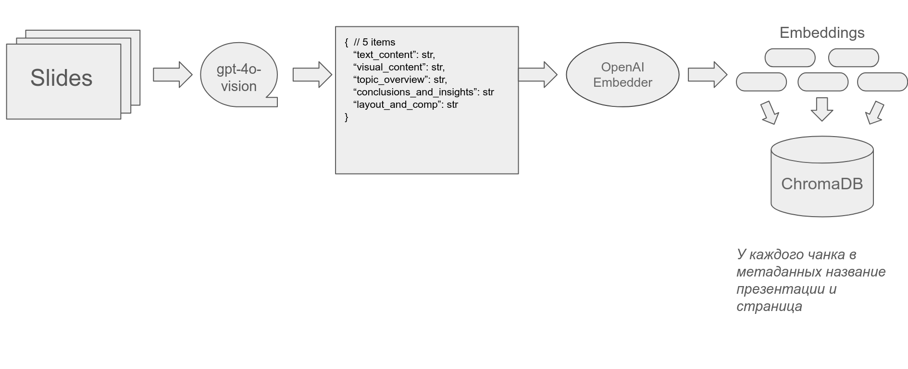
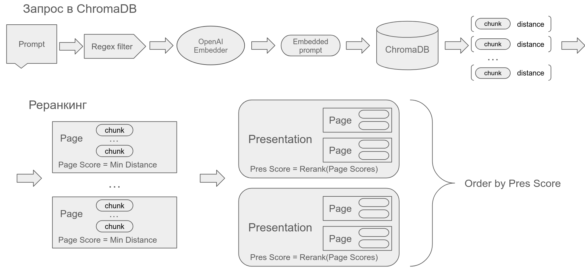
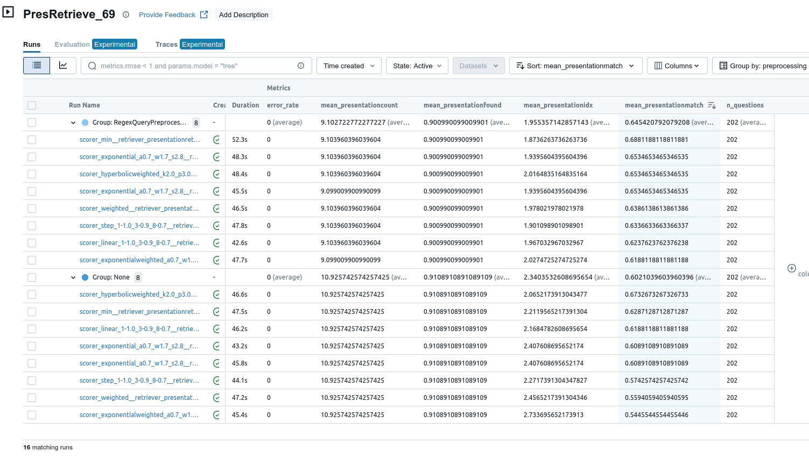
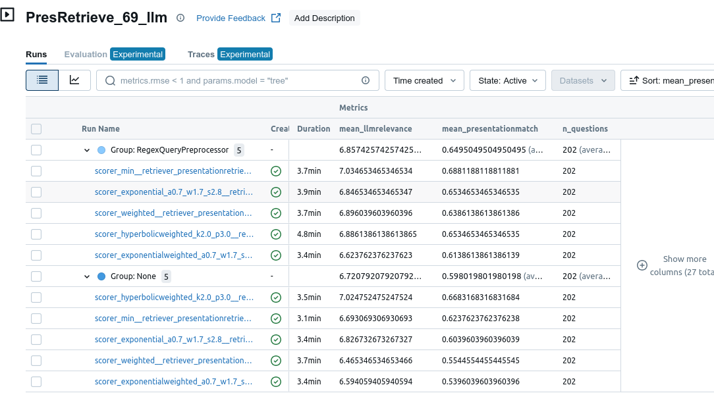
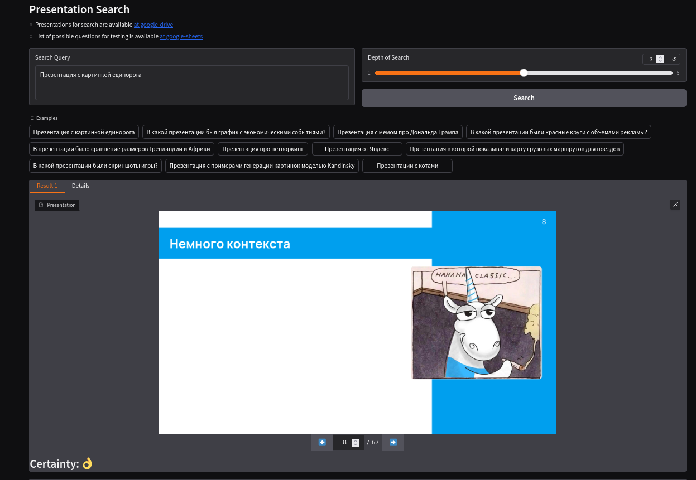

# Presentation-RAG

Проект для семантического поиска по PDF-презентациям.

В бизнесе и науке информацию часто предоставляют в виде презентаций: обзоры отрасли, квартальные отчеты, рекламные рассылки, выступления на конференциях. Если презентаций много, то нужен инструмент для поиска по ним. При поиске по презентациям хочется учитывать текстовое и визуальное содержимое:  списки, таблицы, схемы, картинки, графики.

Идея проекта: с помощью image2text моделей составить описания слайдов, которые учитывают текстовое и визуальное содержимое. А затем искать по ним с помощью векторной базы данных.

Автор: Илья Тамбовцев [t.me/ilchos](https://t.me/ilchos)

Попробовать можно тут: [huggingface/presentation-search](https://huggingface.co/spaces/redmelonberry/presentation-search)
*Без VPN презентации могут не отображаться.*

Видео с демонстрацией: [cсылка на YouTube](http://www.youtube.com/watch?v=5LPl3MBXxzo)

## Функционал

- Извлечение структурированной информации из слайдов презентаций с помощью GPT-4-Vision
- Векторное хранилище описаний слайдов на базе ChromaDB
- Семантический поиск по презентациям с учетом текстового и визуального контента
- Веб-интерфейс для удобного доступа к функциональности поиска

## Курс "Введение в LLM"
### Чекпоинт 1. Данные
Собран датасет презентаций, исследованы статистики файлов: распределения длин, разрешения. Получены описания слайдов из презентаций с помощью gpt-vision, исследованы статистики описаний

### Чекпоинт 2. Валидация
Собран бенчмарк поисковых запросов, проведено тестирование с помощью MLFlow. Предложены несколько вариантов препроцессинга и реранкинга результатов, найден оптимальный - [см. ниже](README.md#бенчмарк)

### Чекпоинт 3. Интерфейс
Веб интерфейс Gradio с хостингом на huggingface

## Установка
*Если очень хочется собрать проект у себя на компьютере, то:*

1. Клонируйте репозиторий:
```bash
git clone <repo_url>
cd presentation-rag
```

2. Установите зависимости через poetry:
```bash
poetry install
```

3. Настройте переменные окружения в `.env`:
```
# Use OpenAI
OPENAI_API_KEY=""

# Or you can use vsegpt.ru
VSEGPT_API_BASE="https://api.vsegpt.ru/v1"
VSEGPT_API_KEY=""

# Configure custom benchmark spreadsheet
BENCHMARK_SPREADSHEET_ID="1qWRF_o-RY1x-o-3z08iVb2akh0HS3ZNxVkZi6yoVsI4"

# Configure ChromaDB storage name for webapp
CHROMA_COLLECTION_NAME="pres_69"
```

## Пайплайн создания векторной базы данных
Эта секция поясняет этапы обработки презентаций для поиска - сбор данных, генерацию описаний, создание векторного хранилища.
Этапы снабжены пояснениями и инструкциями для запуска скриптов.

Вкратце, пайплайн можно проиллюстрировать схемой:



Если вы не планируете воспроизводить результаты или подробно вникать в то, как это работает, то можно переходить к следующей секции.

### 1. Сбор данных
Добавьте презентации в папку raw. Структура директории не важна.

Скачать мои презентации можно [по ссылке](https://drive.google.com/drive/folders/1nUBF-MZgSyuyQEemUXtCj1VDoe1NSqBa?usp=drive_link).

Всего 69 презентаций.

Темы презентаций и источники:
- **data-science**
  - конференция AIConf 2024
  - конференция YappiDays 2024

Это в основном презентации к выступлению. В них мало текста, много картинок, много слайдов

- **business**
  - тг-канал business\_incognita
  - тг-канал insider\_infor

Это скорее презентации для чтения. В них больше текста на слайдах. Слайды в основном содержат много информации, но их общее количество меньше.

Есть ноутбуки с анализом файлов и описаний. Они помогают оценить качество данных на каждом этапе пайплайна.
- [Ноутбук про файлы](notebooks/data_description/count_presentations_metrics.ipynb) - поймем, с какими файлами работаем

### 2. Анализ презентаций

Запустите скрипт для анализа презентаций. Достаточно указать названия файлов без расширения. Не обязательно указывать полный путь.

В результате в папке `interim` появятся json'ы с описаниями презентаций.

```bash
poetry run python -m src.run_descriptions process \
    "4.Обзор уязвимостей и техник защиты для LLM_Евгений Кокуйкин_вер.3" \
    "6.От промпта к агентной системе_Никита Венедиктов_вер.2" \
    "5. Козлов Жизнь в платформе.pptx" \
    \
    --max-concurrent=5
    --provider=openai \ # or vsegpt
    --model-name="gpt-4o-mini" \ # or vis-openai/gpt-4o-mini
```

Важный параметр - max-concurrent. У gpt-4o-mini есть лимит на количество токенов в минуту - 200К. Описание одного слайда составляет 30К токенов. Поэтому если не ограничить количество асинхронных запросов, то api выдаст `rate-limit-error`. У меня опытным путем получилось `max-concurrent=5`. Если использовать vsegpt.ru, то там еще есть запрет "1 запрос в секунду". Поэтому там лучше использовать `max-concurrent=1`, либо надеяться на retry в ChatOpenAI, либо сделать кастомный клиент для vsegpt. Я в итоге просто перешел на ключ от openai.


Формат описания следующий:
```json
{
  "text_content": "string",
  "visual_content": "string",
  "general_description": {
    "topic_overview": "string",
    "conclusions_and_insights": "string",
    "layout_and_composition": "string"
  }
}
```

Промпт для описания можно посмотреть [тут](https://github.com/tambovtsev-io/presentation-search/blob/master/src/chains/prompts.py#L164). Он учитывает несколько факторов:
- Слайды могут быть разной информативности. Хочется, чтобы неинформативные слайды имели короткое описание. Так заглавный слайд или картинка не будут содержать `conclusions_and_insights`.
- Слайды могут содержать таблицы с числовыми данными. Для задачи описания слайдов нет необходимости хранить все данные из ячеек. Таблицы описываются в суммаризованном виде: какие столбцы, колонки, общий посыл.
- На слайдах могут быть названия российских компаний. На этот случай я их тоже добавил в промпт.

В написании промпта мне помог этот гайд - [become god like prompt engineer](https://www.reddit.com/r/ChatGPT/comments/14d7pfz/become_god_like_prompt_engineer_with_this_one/)

Ноутбуки:
- [Ноутбук с примерами описаний](notebooks/data_description/descriptions_examples.ipynb) - посмотрим, как gpt описывает слайды
- [Ноутбук с характеристиками описаний](notebooks/data_description/count_descriptions.ipynb) - посмотрим на статистики сгенерированных описаний

### 3. Создание векторной базы ChromaDB

Преобразуйте результаты анализа в векторное хранилище.

В результате в папке `processed` появится локальное хранилище ChromaDB.

```bash
poetry run python -m src.run_json2chroma convert \
    "4.Обзор уязвимостей и техник защиты для LLM_Евгений Кокуйкин_вер.3" \
    "6.От промпта к агентной системе_Никита Венедиктов_вер.2" \
    "5. Козлов Жизнь в платформе.pptx" \
    \
    --collection=pres_69 \
    --mode=fresh \
    --provider=openai
```

Каждый из элементов описания является целым чанком. Я решил не дробить их долоплнительно. Во-первых так проще. Во-вторых, длина чанков в основном < 700 токенов, и это ок для openai- токенизатора. Для поиска используется косинусное расстояние - чем оно меньше, тем "лучше" результат.

Примеры описаний можно посмотреть [в ноутбуке](notebooks/prompts/descriptions_examples.ipynb).


## Пайплайн поиска презентаций
Эта секция поясняет реализацию поиска презентаций - предобработка, получение чанков, пересортировка результатов.


**Схема обработки запросов**



**Regex Filter.** При работе приложения запросы пользователя проходят предобработку перед поиском по косинусному расстоянию. Из них удаляются стоп слова и фразы, характерные для поиска презентаций - [см. список вопросов](https://docs.google.com/spreadsheets/d/1qWRF_o-RY1x-o-3z08iVb2akh0HS3ZNxVkZi6yoVsI4/edit?usp=sharing).
Идея: "к презентации особо по-другому вопрос не задашь...".

Примеры работы фильтра:
| before | after |
| --- | ---|
| В какой презентации был график с экономическими событиями? | график экономическими событиями |
| На слайде были результаты опроса насчет отрасли в виде круговой диаграммы  | результаты опроса насчет отрасли виде круговой диаграммы |
| Презентация про нейросети Колмогорова | нейросети Колмогорова-Арнольда |
| Слайд со схемой обучения трансформеров OZON  | схемой обучения трансформеров OZON |
| Где говорили про делегирование?  | делегирование |
| В какой презентации говорили об инструменте для совместной работы?  | инструменте совместной работы |
| На слайде были логотипы сервисов Яндекса  | логотипы сервисов Яндекса |

**Поиск.** ChromaDB возвращает некотороые чанки: `visual_content`, `text_content` и т.д. Если для одной страницы нашлось несколько чанков, то они группируются в страницы. Скор страницы - это минимальный из скоров её чанков. Далее страницы группируются по принадлежности презентации. Примеры запросов в базу можно посмотреть в ноутбуке [rag/chroma\_queries](notebooks/rag/chroma_metric_research.ipynb)

**Реранкинг.** Будем считать, что если в презентации нашлось много страниц, то она более релевантна. Для этого будем уменьшать скор презентации в зависимости от числа страниц. Примеры функций есть в ноутбуке [rag/chroma\_metric\_research](notebooks/rag/chroma_metric_research.ipynb). Сначала этот подход давал положительные результаты. Он лучше отвечал на запросы общего вида: "благополучие", "презентация про компьютерное зрение". Но на бенчмарке оказалось, что вариант без реранкинга, но с препроцессингом работает лучше.


## Бенчмарк
Для проверки качества поиска я собрал [датасет вопросов](https://docs.google.com/spreadsheets/d/1qWRF_o-RY1x-o-3z08iVb2akh0HS3ZNxVkZi6yoVsI4/edit?usp=sharing). В вопросах отражены самые запоминающиеся элементы презентаций. Вопросы разделены по категориям:
- text - вопросы точно по тексту:
    - "Презентация в которой рассматривались субсидии для сельского хозяйства"
    - "Гармонизация изображений"
- visual - вопросы по визуальному содержимому - картинкам, таблицам, схемам:
    - "Презентация с картинкой единорога"
    - "В какой презентации были красные круги с объемами рекламы?"
- general - вопросы по общему содержимому презентации/слайдов. Не содержат текста из презентации напрямую.
    - "Презентация со сравнением нейросетей и бустингов"
    - "Презентация про разные методы генерации изображений"

Для отображения результатов используется MLFlow. Сначала пробовал на LangSmith, но там быстро закончилась бесплатная квота и было неудобно добавлять свои метрики.

Команда для запуска интерфейса MLFlow:

```sh
poetry run mlflow ui --backend-store-uri sqlite:///data/processed/eval/runs/mlruns.db
```

Команда для запуска тестирования:
```sh
poetry run python -m src.run_evaluation mlflow \
    --retriever="basic" \
    --n_contexts=-1 \
    --n_pages=-1 \
    --provider="openai" \
    --scorers=[basic] \
    --metrics=[basic] \
    --max_concurrent=10 \
    --model_name="gpt-4o-mini" \
    --collection="pres_69" \
    --experiment="PresRetrieve_69" \
    --n_questions=-1 \
    --temperature=0.2 \
    --sheet_id="AllQuestions" \
    --write_to_google=false \
    --rate_limit_timeout=-1
```

### Результаты Бенчмаркинга


В датасете 69 презентаций. Каждый эксперимент отвечает отдельному методу реранкинга. Есть две группы - с regex-препроцессингом и без препроцессинга.
Первые два столбца в экспериментах одинаковые, потому что retriever у них один.
Разница в том, в каком порядке они будут выданы пользователю. Хочется сделать такой реранкинг, чтобы выдача была более релевантной. Подробнее про реранкинг [есть ноутбук](notebooks/rag/chroma_metric_research.ipynb)

Интерпретация:
В 90% мы находим нужную презентацию (`presentationfound`). При этом в среднем входит в топ-2 или топ-3 выдачи (`presentationidx`). Однако на первом месте в выдаче нужная презентация оказывается в ~70% случаев (`presentationmatch`).

Выводы:
- с препроцессингом лучше
- если использовать препроцессинг, то лучше всего работает обычный `min-scorer` - без реранкинга
- если без препроцессинга, то лучше всех отработал `hyperbolic-scorer`

Еще я пробовал оценивать LLM-кой релевантность выдачи. Просил давать оценку релевантности от 0-10. Промпт можно посмотреть [тут](https://github.com/tambovtsev-io/presentation-search/blob/master/src/eval/eval_mlflow.py#L237):

Получилось неинформативно - при большой разнице в `match` разница по оценке LLM маленькая.




## Веб-интерфейс

Команда для запуска веб-приложения:

```bash
poetry run python -m src.webapp.app --collection pres_69 --host 0.0.0.0 --port 7860
```




Простой поисковой интерфейс. Открывается на самой релевантной странице из презентации. Страницы можно переключать.
- Крутилка `Depth of Search` отвечает за количество чанков, которые достаются из презентации. Сейчас она не особо влияет на выдачу, так что можно оставить дефолтное значение.
- Оценка `Certainty` - то, насколько мы уверены в результате поиска. Сейчас она задается через пороговые значения, подобранные опытным путем.
- Вкладка `Detailed Results` - подробные описания результатов, найденных в базе – скоры презентации, страниц, чанков


## Структура проекта
Эта секция посвящена коду. Суть проекта и основные идеи описаны выше. Здесь будут пояснения по модулям и реализации. Для некоторых модулей есть ноутбуки.

Если код вам не так важен, можете пропускать эту часть.

```
presentation-search/
├── data/              # Директория данных
│   ├── raw/           # Исходные презентации
│   ├── interim/       # Промежуточные результаты анализа
│   └── processed/     # Обработанные данные и векторные базы
├── docs/              # Документация
├── notebooks/         # Jupyter ноутбуки
└── src/               # Исходный код
    ├── chains/        # Цепочки обработки с LangChain
    ├── config/        # Конфигурация
    ├── eda/           # Разведочный анализ данных
    ├── eval/          # Оценка качества
    ├── processing/    # Утилиты обработки
    ├── rag/           # Модули RAG
    ├── testing_utils/ # Тестовые утилиты
    └── webapp/        # Веб-приложение
```
### Основные модули (src/)

#### chains/
Цепочки обработки на базе LangChain для анализа презентаций:
- `chains.py` - Базовые цепочки для работы с PDF и изображениями (FindPdfChain, LoadPageChain, Page2ImageChain и др.)
- `pipelines.py` - Пайплайны для обработки презентаций (SingleSlidePipeline, PresentationPipeline)
- `prompts.py` - Промпты для анализа слайдов (JsonH1AndGDPrompt)

#### config/
Конфигурация и утилиты проекта:
- `config.py` - Основной класс конфигурации
- `model_setup.py` - Настройка языковых моделей и эмбеддингов
- `navigator.py` - Навигация по структуре проекта
- `output_formatting.py` - Форматирование вывода
- `logging.py` - Настройка логирования

#### eda/
Инструменты для разведочного анализа данных:
- `explore.py` - Функции для анализа презентаций, подсчета токенов и оценки стоимости

Есть ноутбуки:
- [анализ pdf-файлов презентаций](notebooks/data_description/count_presentations_metrics.ipynb)
- [анализ описаний от gpt-vision](notebooks/data_description/count_descriptions.ipynb)

#### eval/
Модули для оценки качества:
- `eval_mlflow.py` - Метрики и логирование экспериментов в MLflow
- `evaluate.py` - Оценка качества результатов с использованием LangSmith. Мб не работает, потому что в итоге я перешел на MLFlow.

#### processing/
Утилиты для обработки файлов:
- `image_utils.py` - Работа с изображениями (конвертация в base64)
- `pdf_utils.py` - Работа с PDF (конвертация страниц в изображения)

#### rag/
Компоненты для Retrieval-системы:

- `preprocess.py` - Предобработка поисковых запросов.

Regex-препроцессинг - убираются часто-повторяющиеся фразы. Идея: "а сильно по-другому к презентации вопрос и не задашь" - [см. бенчмарк из 200 вопросов](https://docs.google.com/spreadsheets/d/1qWRF_o-RY1x-o-3z08iVb2akh0HS3ZNxVkZi6yoVsI4/edit?usp=sharing)

- `score.py` - Скоринг результатов поиска для реранкинга

Идея: "Давайте делать презентацию более релевантной, если поиск вернул много страниц из нее". [Подробнее есть ноутбук](notebooks/rag/chroma_metric_research.ipynb)

- `storage.py` - Работа с векторным хранилищем ChromaDB

Два режима - с препроцессингом, и без. [Есть ноутбук с примерами запросов к базе](notebooks/rag/chroma_queries.ipynb)

#### testing\_utils/
Утилиты для тестирования:
- `echo_llm.py` - Тестовая LLM, возвращающая входные данные

#### webapp/
Веб-интерфейс на Gradio:
- `app.py` - Основное веб-приложение для поиска по презентациям

### Основные скрипты

- `run_descriptions.py` - Запуск анализа презентаций с помощью GPT-4V
- `run_json2chroma.py` - Конвертация результатов анализа в векторное хранилище
- `run_evaluation.py` - Бенчмаркинг поисковика
- `run_webapp.py` - Запуск приложения на gradio

## Дополнительно

- [Гайд по DVC](docs/workflow/data_version_control.md)
- [Гайд по разрешениям картинок](docs/workflow/resolutions.md)
- [Примеры запусков комманд](docs/workflow/run_commands.sh)

### Ноутбуки

*Вкатываемся в Document Understanding*

- [Ноутбук с примерами описаний слайдов](notebooks/weird-slides/weird_slides.ipynb)
- [Ноутбук с примерами LLamaParse](notebooks/weird-slides/llamaparse.ipynb)
- [Ноутбук с ресерчем про разрешения картинки](notebooks/weird-slides/lowering_img_quality.ipynb)
- [Ноутбук с разрешениями презентаций и расчетом цен](notebooks/data_description/count_presentations_costs.ipynb)

*Описания презентаций*

- [Ноутбук с примерами форматированных описаний](notebooks/prompts/descriptions_examples.ipynb) - описания нескольких слайдов
- [Ноутбук с примерами описаний перзентаций](notebooks/prompts/testing_prompts.ipynb) - полностью описанные презентации
- [Ноутбук с распределением количества токенов в полученных описаниях](notebooks/data_description/count_descriptions_metrics.ipynb)

*RAG*

- [Ноутбук с примерами запросов к RAG](notebooks/rag/chroma_queries.ipynb)
- [Ноутбук про реранкинг](notebooks/rag/chroma_metric_research.ipynb)


### Ссылки

- [Гугл-диск с презентациями](https://drive.google.com/drive/folders/1IvUsxxtyyTuHdZff9szhd2OtIATRTcG4?usp=sharing)
- [Гугл-таблица с бенчмарком](https://docs.google.com/spreadsheets/d/1qWRF_o-RY1x-o-3z08iVb2akh0HS3ZNxVkZi6yoVsI4/edit?usp=sharing)

