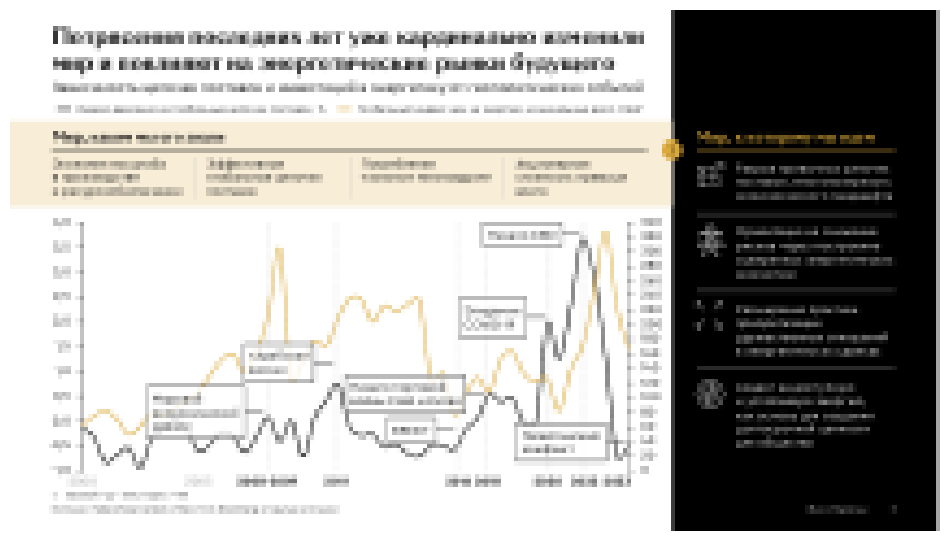
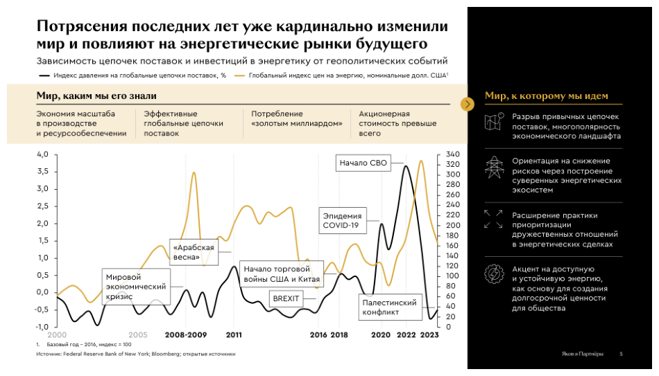

# Как модель описывает изображения плохого качества

## dpi

Завысим dpi - увеличим нагрузку на LLM. Мы хотим подавать изображения в Vision Transformer. Он принимает изображения в виде base64-строки. Ее длина зависит от размера изображения. dpi - параметр масштаба изображения. Больше dpi - длиннее base64-строка.

## Эксперимент
[Ссылка на ноутбук](/notebooks/weird-slides/lowering_img_quality.ipynb)

Выбрал 4 слайда и конвертировал в изображение с `dpi=[72, 48, 36, 24, 16]`. Использовал промпт:

```
Представь, что я ничего не вижу. 
Я пришлю тебе слайд из презентации, а ты опиши его.
Передай мне содержимое слайда в мельчайших подробностях.
```


## Результаты

### Выводы
Можно не увеличивать dpi.  
С dpi=72 проблем не было.

### Наблюдения

\*\* гал - галлюцинация

- dpi=72: Без ошибок
- dpi=48: 1 гал на мелком тексте
- dpi=36: Много гал. 
  - Ошибочно считывает числа
  - Выдумывает содержимое таблицы
  - Теряет существующие поля таблицы
- dpi=24: Много гал
  - видит только заголовки и структуру
  - различает большие картинки
- dpi=16: тут ничего не видно, гпт выдает краткую галлюцинацию

#### ГПТ не умеет оценивать качество изображений
|                      dpi=16                      |                       original                        |
| :----------------------------------------------: | :---------------------------------------------------: |
|  |  |

**Описание слайда с dpi=16:**
```
Слайд состоит из двух основных частей: графика и текстового блока.

### Левая часть (график):
- **Заголовок:** "Потрясения последних лет уже кардинально изменили мир и повлияют на 
энергетические рынки будущего".
- **Подзаголовок:** "Мировые цены на газ".      # <- в оригинале не про газ
- **График:** Линии показывают изменения цен на газ с 2000 по 2022 год.
  - **Черная линия:** Цена на газ в США.        # <- в оригинале индексы
  - **Оранжевая линия:** Цена на газ в Европе.
- **Ключевые события на графике:**              # <- Есть совпадения, но большая часть мимо
  - 2008: Финансовый кризис.
  - 2011: Арабская весна.                       
  - 2014: Кризис на Украине.
  - 2020: Пандемия COVID-19.
  - 2022: Конфликт в Украине.

### Правая часть (текстовый блок):
- **Заголовок:** "Мир, в котором мы живем".
- **Список с иконками:**
  1. **Иконка глобуса:** Глобальные потрясения влияют на энергетические рынки.
  2. **Иконка графика:** Цены на энергоносители нестабильны.
  3. **Иконка завода:** Изменения в производстве и потреблении энергии.
  4. **Иконка руки с монетой:** Экономические последствия для стран и компаний.

Фон слайда светлый, текст и графики выполнены в черных и оранжевых тонах.
```


**Просил не анализировать слайды плохого качества:** `Если на слайде есть текст, но ты не можешь его различить, напиши об этом. Не пытайся восстановить содержимое.`
ГПТ выдал меньше текста. Где-то говорил "сопровождаемые текстовыми пояснениями". Но насчет заголовков галюцинировал.
```
На слайде представлена информация о влиянии климатических изменений на энергетические 
рынки. 

### Левая часть слайда:
- **Заголовок:** Говорит о последствиях климатических изменений за последние десятилетия.
- **График:** 
  - Две линии: одна черная, другая оранжевая.
  - Ось X: временная шкала с 2000 по 2022 год.
  - Ось Y: вероятно, отражает какой-то количественный показатель.
  - На графике отмечены несколько пиков и спадов, сопровождаемые текстовыми пояснениями.

- **Текстовые блоки над графиком:** 
  - Описывают различные периоды и события, влияющие на изменения на графике.

### Правая часть слайда:
- **Заголовок:** "Мир, в котором мы живем".
- **Список:** Несколько пунктов, каждый из которых сопровождается иконкой. Пункты 
описывают различные аспекты текущей ситуации в мире, связанные с климатом и энергетикой.

Цветовая гамма слайда включает черный, белый и оранжевый цвета.

```


**Попросил оценить качество слайда с dpi=16.** ГПТ сгаллюцинировал позитивную оценку. 
```
Представь что ты жюри по оценке презентаций. Будь объективен в своих оценках.
Оцени качество слайда.
Используй следующие критерии:
- Разборчивость текста
- Качество изображений
- Читаемость графиков

Каждому пункту поставь оценку от 1 до 5 и дай комментарий.
```

ГПТ раздал оценки 4-5 и позитивные комментарии - "Текст на слайде разборчивый":
```
### Оценка слайда:

#### Разборчивость текста: 4/5
- **Комментарий:** Текст на слайде в целом разборчивый, но мелкий шрифт в некоторых местах
 может затруднить чтение, особенно на графике и в боковой панели.

#### Качество изображений: 5/5
- **Комментарий:** Изображения и графики четкие и хорошо видны. Цветовая схема помогает 
выделить ключевые элементы.

#### Читаемость графиков: 4/5
- **Комментарий:** График хорошо структурирован и понятен, но мелкие подписи и детали 
могут быть трудны для восприятия на расстоянии. Улучшение читаемости можно достичь 
увеличением шрифта или упрощением деталей.
### Оценка слайда:

#### Разборчивость текста: 4/5
- **Комментарий:** Текст на слайде в целом разборчивый, но мелкий шрифт в некоторых местах
 может затруднить чтение, особенно на графике и в боковой панели.

#### Качество изображений: 5/5
- **Комментарий:** Изображения и графики четкие и хорошо видны. Цветовая схема помогает 
выделить ключевые элементы.

#### Читаемость графиков: 4/5
- **Комментарий:** График хорошо структурирован и понятен, но мелкие подписи и детали 
могут быть трудны для восприятия на расстоянии. Улучшение читаемости можно достичь 
увеличением шрифта или упрощением деталей.
```